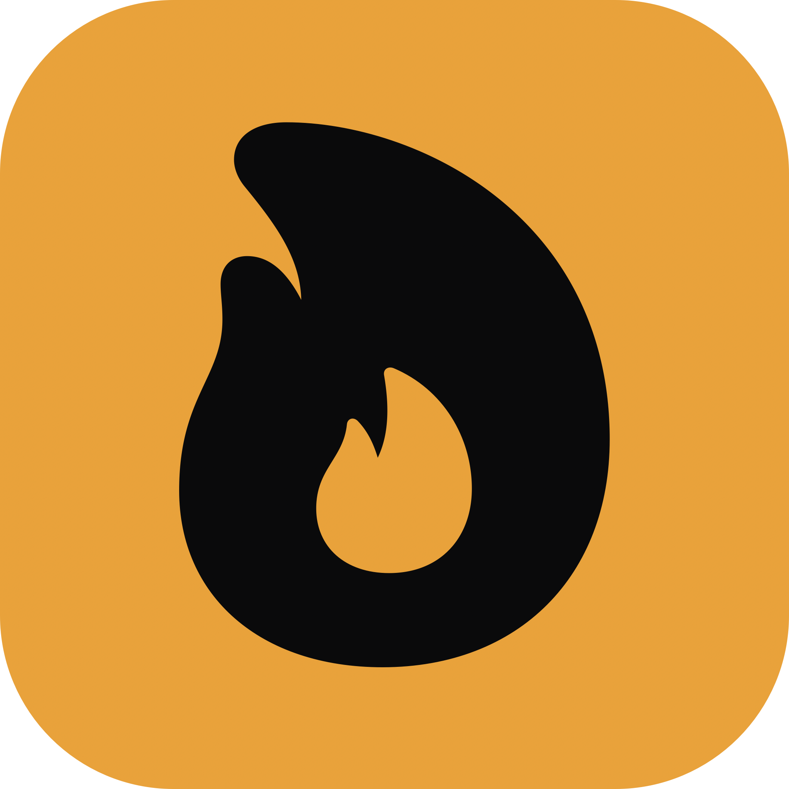

<p align="center">
  
</p>

<h1 align="center">Kiln</h1>

<p align="center">A native Mac app for agent CLIs like <a href="https://claude.com/claude-code">Claude Code</a> and Codex.</p>

<p align="center">
  <a href="https://github.com/raya-ac/kiln/actions/workflows/ci.yml"></a>
  <a href="https://github.com/raya-ac/kiln/releases/latest"></a>
  <a href="LICENSE"></a>
  
  
</p>

Kiln runs agent CLIs as a proper desktop app instead of another terminal tab. Sessions live in a sidebar, approvals pop up as real dialogs, and the whole thing feels like the rest of your Mac. Built in SwiftUI. macOS 14 or later, Apple Silicon or Intel.

## Why

I wanted the feel of a native editor — command palette, keyboard shortcuts, a sidebar — without giving up the CLI workflow underneath. So Kiln wraps the agent CLI, keeps a session per project, and adds the stuff that's awkward to do in a terminal: per-session tunnels, remote control from another device, real video/image previews, clean export.

It's still early. I use it every day; you might want to wait.

## What's in it

- Sessions per project, code and chat split into two sidebars.
- Command palette (⌘K), Quick Open (⌘P), global message search (⇧⌘F).
- Built-in editor with inline agent edit diffs (accept / revert),
  breadcrumbs, and keyboard shortcuts.
- Git-aware file tree — per-file status markers, directory roll-up, branch
  pill in the workdir header, "Show Diff vs HEAD" on any modified file,
  and "Ask About This File" right from the context menu.
- Workdir activity chip above the composer — shows what the active agent's tools
  touched since HEAD, click a row for the diff. Event-driven, no polling.
- Claude sessions keep working when you move their workdir — the underlying
  CLI conversation file is migrated into the new project dir so context
  carries across the move. Codex sessions currently start fresh after a
  workdir change.
- ~60 local slash commands for git, repo inspection, clipboard/export,
  and quick session ops — typed right in the composer.
- Cmd+Opt+1..9 to jump to the Nth visible session in the current tab.
- 16 languages in Settings with full UI translations — English, German,
  Chinese, French, Spanish, Japanese, Italian, Portuguese, Russian,
  Korean, Dutch, Hindi, Arabic, Polish, Turkish, Swedish.
- Per-session Cloudflare tunnels for remote control from your phone.
- Real approval dialogs for Claude sessions instead of terminal prompts.
- Dock icon that live-tints to your accent color and follows dark mode.
- Sparkle auto-updates.

## Running it

Clone and build:

```bash
git clone https://github.com/raya-ac/kiln
cd kiln
swift build -c release
open .build/release/Kiln
```

That gets you the raw binary. To produce a real `Kiln.app` bundle (the kind Finder recognises, with auto-updates wired up):

```bash
./scripts/make-app-bundle.sh 1.9.1 arm64      # Apple Silicon
./scripts/make-app-bundle.sh 1.9.1 x86_64     # Intel
open dist/arm64/Kiln.app
```

Either works fine for trying it out.

## Releases & auto-updates

Push a tag like `v1.9.1` and GitHub Actions will:

1. Build separate Apple Silicon and Intel `.app` bundles.
2. Code-sign and notarise them (if you've added the Apple secrets).
3. Sign both zips with Sparkle's EdDSA key.
4. Regenerate `appcast.xml` — Sparkle reads the binary of each zip and stamps the correct architecture on the feed item, so each Mac pulls the build that matches it.
5. Commit the new `appcast.xml` back to `main` and publish a GitHub release with both zips attached.

Inside the app, **Kiln → Check for Updates…** hits that appcast. Scheduled checks run once a day.

## Setting up releases

If you're forking this, you'll need a few secrets on your repo at `Settings → Secrets and variables → Actions`.

For Sparkle (required for auto-updates to actually verify):

| Secret | Why |
| --- | --- |
| `SPARKLE_ED_PRIVATE_KEY` | Signs the update zips. Keep it safe. |
| `SPARKLE_ED_PUBLIC_KEY` | Embedded in the app so it can verify updates came from you. |

Generate the pair once:

```bash
curl -LO https://github.com/sparkle-project/Sparkle/releases/download/2.6.4/Sparkle-2.6.4.tar.xz
tar -xJf Sparkle-2.6.4.tar.xz
./bin/generate_keys       # adds private key to your Keychain; prints the public half
./bin/generate_keys -x    # prints the private key — base64 it for the GH secret
```

For Apple code-signing and notarisation (optional — leave blank and the workflow skips these steps, but users will see a Gatekeeper warning on first launch):

| Secret | Why |
| --- | --- |
| `APPLE_CERT_P12` | Your Developer ID Application cert exported as a `.p12`, base64-encoded. |
| `APPLE_CERT_P12_PASSWORD` | Password you set on the `.p12`. |
| `APPLE_CODESIGN_IDENTITY` | e.g. `Developer ID Application: Your Name (TEAMID)`. |
| `APPLE_API_KEY_P8` | App Store Connect API key for `notarytool`, base64-encoded. |
| `APPLE_API_KEY_ID` | The 10-char key ID. |
| `APPLE_API_ISSUER_ID` | Issuer UUID from App Store Connect. |

## Layout

```
Sources/
  App/          entry point, AppDelegate
  Views/        SwiftUI views — sidebar, chat, settings
  Services/     AppStore, Claude/Codex backends, remote control, tunnels, updater
  Models/       domain types
scripts/        make-app-bundle.sh + entitlements
.github/        CI + release workflows
```

## Development shortcuts

Common commands are wrapped in a `Makefile`:

```bash
make           # lists everything
make run       # debug build + open the binary
make bundle VERSION=1.9.1 ARCH=arm64
make lint      # swift-format --lint
make format    # swift-format --in-place
make logo      # re-render the brand mark
make ci-local  # run everything CI runs, locally
```

## Contributing

It's a personal project but PRs are welcome. Build with `swift build`, run with `open .build/debug/Kiln` (or the release variant), and the CI workflow will catch the obvious stuff. See [CONTRIBUTING.md](CONTRIBUTING.md) for the shape of a good patch and [CODE_OF_CONDUCT.md](CODE_OF_CONDUCT.md) for how we behave in issues and PRs.

Security issues: please don't file them as public issues — see [SECURITY.md](SECURITY.md).

## Licence

[MIT](LICENSE).
